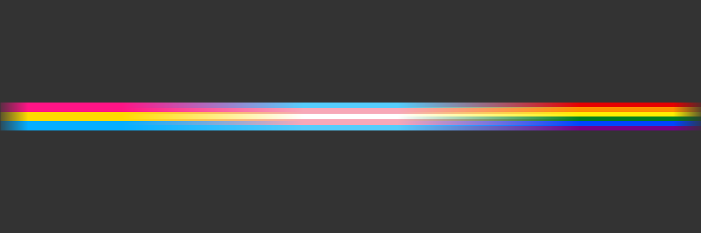

# Pride Gradient designer

Processing3 sketch to create a banner graphic such as 

## To customize
Under the [`SETTINGS` comment](./pridebanner.pde#L1) you can fiddle with the background color, flag dimensions, and fade/border settings.

### Changing flags
Under the [`FLAG SETUP` comment](./pridebanner.pde#L36) you can add or remove flags. As everything calculated is an int, it will work smoother if your flag height is a common multiple of the number of stripes each flag you use has. The `stripe()` class takes a color (hex code or Processing color type) and a y-axis offset from the top of the flag.

### Dimensions
To change the dimensions from standard Twitter heading size, change this [line that sets the size](./pridebanner.pde#L27).
